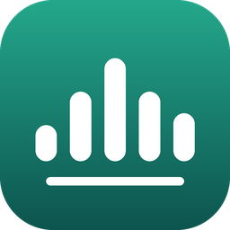
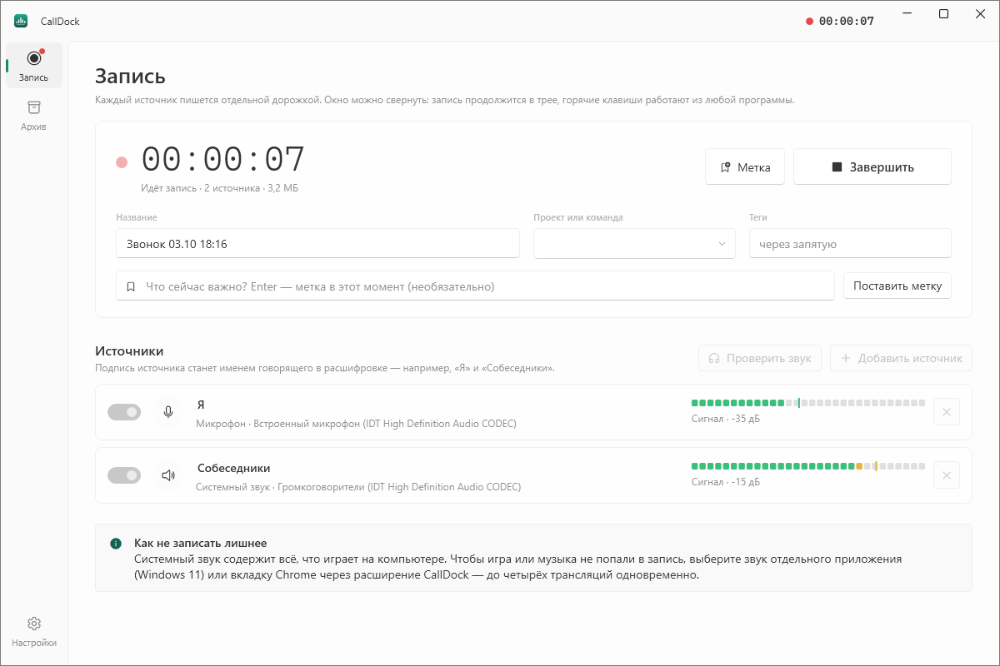
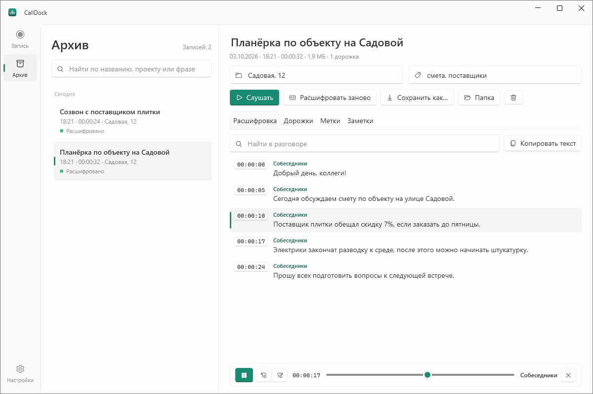
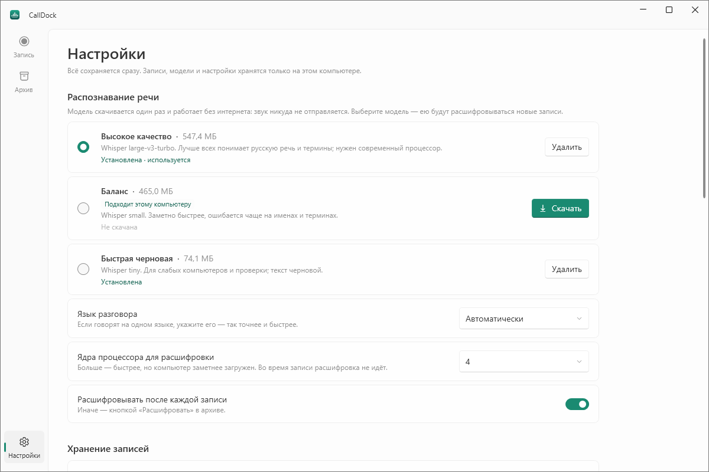
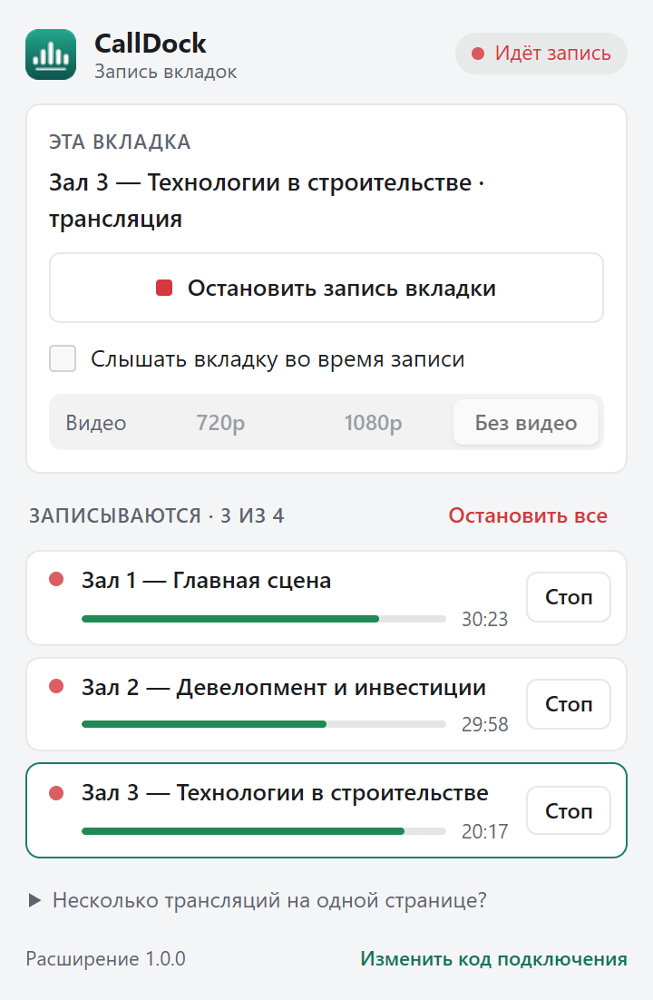

<p align="center">
  
</p>

<h1 align="center">CallDock</h1>

<p align="center">
  Запись звонков, встреч и трансляций на Windows — каждый источник своей дорожкой,<br>
  с расшифровкой прямо на компьютере и архивом с поиском по словам.
</p>

<p align="center">
  <a href="https://github.com/nkVas1/CallDock/releases/latest"></a>
  <a href="https://github.com/nkVas1/CallDock/actions/workflows/ci.yml"></a>
  <a href="LICENSE"></a>
</p>

<p align="center">
  
</p>

## Что умеет

- **Пишет каждый источник отдельной дорожкой** в исходном качестве: свой микрофон, звук собеседников, звук отдельного
  приложения, экран или окно, поток по ссылке. Во время записи — WAV, после — FLAC 24 бит без потерь.
- **До четырёх трансляций Chrome одновременно** через расширение CallDock: каждая вкладка — своя дорожка; другие вкладки,
  музыка и игры в запись не попадают.
- **Расшифровывает речь на этом компьютере** (Whisper): звук никуда не отправляется. Реплики подписаны по источникам —
  «Я», «Собеседники», «Зал 1».
- **Замечает звонки**: когда Zoom, Телемост, Telegram или встреча в браузере включает микрофон, CallDock предлагает
  записать — или начинает сам, если так настроено.
- **Сводит дорожки сам**: после записи экрана получается видео со звуком всех участников, после звонка — общий звук.
  Отдельные дорожки остаются для расшифровки и правки.
- **Источники подключаются на ходу**: микрофон, системный звук или экран можно включить и выключить прямо во время
  записи — каждая дорожка встанет на шкалу времени туда, где началась.
- **Пауза**: на время перерыва запись останавливается во всех дорожках сразу — микрофон, экран, вкладки Chrome.
  Сказанное во время паузы никуда не попадает, а в расшифровке её место отмечено.
- **Правка расшифровки**: двойной щелчок по слову — и можно вписать верное; исправленное слово программа предложит
  заменить во всей записи. Говорящего можно переименовать, фразу — отдать другому, лишнее — удалить. Любая правка
  отменяется.
- **Архив с поиском** по названию, проекту, тегам и словам из разговора. Щелчок по фразе включает её звук.
- **Экспорт** текста в TXT, Markdown, SRT, VTT, JSON; звука — в WAV, FLAC, MP3, M4A.
- **Не мешает работать**: живёт в трее, горячие клавиши работают из любой программы, запись переживает сбой и
  выключение компьютера.

<p align="center">
  
</p>

## Установка

1. Откройте [последний выпуск](https://github.com/nkVas1/CallDock/releases/latest) и скачайте
   **`CallDock-win-Setup.exe`** — установщик с автообновлением.
   Нужна версия без установки — **`CallDock-win-Portable.zip`**: распакуйте в любую папку и запустите `CallDock.exe`.
2. Windows может показать «Система Windows защитила ваш компьютер»: программа пока не подписана сертификатом.
   Нажмите **Подробнее → Выполнить в любом случае**.
3. При первом запуске откройте **Настройки → Распознавание речи** и скачайте модель. Плашка «Подходит этому
   компьютеру» подскажет, какую: «Высокое качество» точнее всех, но ей нужен мощный процессор (от 8 потоков);
   «Баланс» работает на обычном ноутбуке.

<p align="center">
  
</p>

Установщику не нужны права администратора. Обновления CallDock скачивает сам и предлагает перезапуститься —
идущую запись это не прерывает.

**Требования:** Windows 10 (1809 и новее) или Windows 11, 64 бит. Звук отдельного приложения записывается только в
Windows 11 — в Windows 10 используйте «Системный звук» или вкладку Chrome.

## Как пользоваться

**Звонок в Zoom, Телемосте, Teams, Discord.** На вкладке «Запись» уже есть два источника: микрофон («Я») и системный
звук («Собеседники»). Нажмите «Начать запись» или <kbd>Ctrl</kbd>+<kbd>Alt</kbd>+<kbd>R</kbd>. Важный момент
отметьте кнопкой «Метка» или <kbd>Ctrl</kbd>+<kbd>Alt</kbd>+<kbd>M</kbd> — он появится в архиве. Окно можно закрыть:
запись продолжится в трее (значок станет красным).

**Пауза** — кнопка «Пауза» на пульте, пункт в меню трея или <kbd>Ctrl</kbd>+<kbd>Alt</kbd>+<kbd>P</kbd>. Время записи
останавливается, и ни одна дорожка — ни микрофон, ни экран, ни вкладки Chrome — не пишет, пока не нажата «Продолжить».
Пауза вырезана из записи целиком, дорожки остаются в такт друг другу, а в расшифровке на её месте стоит отметка
«— пауза 5 мин —». На паузе значок в трее и точка у часов становятся янтарными.

**CallDock замечает звонки.** Когда другое приложение включает микрофон, в углу экрана появляется подсказка
«…использует микрофон — записать звонок?». Она не отнимает фокус у звонка и сама исчезает через полминуты. Когда
звонок кончается и приложение отпускает микрофон, CallDock предлагает завершить запись и через минуту завершает её
сам, если не нажать «Продолжить». В «Настройки → Запись» можно выбрать «Записывать сразу» или выключить подсказки.
Записи, начатые вручную, CallDock сам не останавливает.

**Чтобы музыка или игра не попали в запись,** вместо системного звука добавьте звук только нужного приложения
(«Добавить источник» → «Звук приложения», Windows 11) или вкладку Chrome.

**Подпись источника** — это имя говорящего в расшифровке. Щёлкните по названию карточки и переименуйте: «Я»,
«Заказчик», «Зал 2».

**Во время записи** источники можно включать и выключать переключателем на карточке, а «Добавить источник» сразу
подключает новый к идущей записи. Например, начали звонок без экрана — включите «Экран», когда собеседник начал
показывать презентацию. Источник, выключенный и включённый снова, остаётся тем же говорящим в расшифровке.

После записи CallDock сжимает звук без потерь, **сводит дорожки** и расшифровывает разговор. Пока идёт обработка,
можно записывать следующий звонок: новая работа ждёт окончания записи.

**Сведение.** Если записывался экран, его видео получает звук всех дорожек — готовый ролик, который можно сразу
отправить (картинка при этом не копируется и места не занимает вдвое). Без экрана получается общий звук в M4A.
«Слушать» и щелчок по фразе в архиве играют именно сведение. На вкладке «Дорожки» его можно сохранить или свести
заново — выбрать, чьи голоса войдут и какое видео будет картинкой. Записи нескольких трансляций из Chrome сами не
сводятся: залы конференции не стоит слушать одновременно. Отключить сведение можно в «Настройки → Хранение записей».

**Правка расшифровки.** Распознавание ошибается в именах и терминах — это исправляется прямо в архиве:

- **Исправить слово** — двойной щелчок по нему: фраза откроется для правки с выделенным словом, остаётся вписать
  верное и нажать <kbd>Enter</kbd> (<kbd>Esc</kbd> — отменить). То же — <kbd>F2</kbd> или карандаш справа от фразы.
  Если исправленное слово встречается в других фразах, CallDock предложит заменить его везде одной кнопкой.
- **Переименовать говорящего** — щелчок по имени над фразой: «Собеседники» станут «Иваном Петровичем» во всех фразах.
- **Отдать фразу другому** — там же, «Сменить говорящего»: если системный звук записал нескольких собеседников,
  фразы можно разнести по именам. Несколько фраз выделяются, как в Проводнике, — с <kbd>Shift</kbd> или
  <kbd>Ctrl</kbd>. Фраза по-прежнему играет со своей дорожки.
- **Удалить лишнее** — <kbd>Delete</kbd> или правая кнопка → «Удалить фразу».

Любая правка отменяется кнопкой «Отменить» или <kbd>Ctrl</kbd>+<kbd>Z</kbd>, а у исправленной фразы помечено
«исправлено» — подсказка покажет, что было распознано. Правки сразу попадают в поиск по архиву и в сохранённый текст.
«Расшифровать заново» перед тем, как заменить исправленный текст, спросит.

## Трансляции в Chrome (до четырёх сразу)



Расширение ставится один раз:

1. В CallDock откройте **Настройки → Chrome** и нажмите **«Открыть папку расширения»**.
2. В Chrome откройте `chrome://extensions`, включите **«Режим разработчика»** справа вверху.
3. Нажмите **«Загрузить распакованное расширение»** и выберите открывшуюся папку `extension`.
4. Закрепите значок CallDock на панели (значок пазла → булавка).
5. В CallDock нажмите **«Скопировать код»**, щёлкните значок расширения и вставьте код.

Запись: откройте трансляцию, нажмите значок CallDock → **«Записывать эту вкладку»**. Повторите для каждой
трансляции — каждая вкладка будет своей дорожкой одной записи. Запись, начатая из Chrome, заканчивается вместе с
последней вкладкой — если к ней не подключены другие источники.

- **«Вместе с источниками CallDock»** — первая вкладка сразу включит и то, что включено на пульте CallDock: микрофон,
  системный звук, экран. Удобно для встречи в браузере: собеседники — из вкладки, ваш голос — с микрофона. К уже
  идущей записи источники добавляются в самом CallDock.

- **«Слышать вкладку во время записи»** — Chrome приглушает записываемую вкладку; галочка возвращает звук.
- **«Пауза»** над списком вкладок ставит на паузу всю запись CallDock — вкладки вместе с микрофоном и экраном.
- **Видео: 720p, 1080p или «Без видео».** Для трёх-четырёх трансляций сразу или игры параллельно выбирайте
  «Без видео»: на слабом компьютере видео отнимает процессор, и звук может оборваться раньше. Если такое
  случилось, CallDock напишет об этом у дорожки.
- **После обновления CallDock** откройте `chrome://extensions` и нажмите ↻ у расширения — Chrome продолжает
  выполнять старую версию до перезагрузки (окно расширения об этом напомнит).

Расширение работает и в Microsoft Edge (`edge://extensions`).

<br clear="right">

## Где хранятся данные

| Что | Где |
|---|---|
| Записи и расшифровки | `Документы\CallDock` — можно перенести в настройках |
| Настройки и код подключения расширения | `%APPDATA%\CallDock` |
| Программа, модели распознавания, журналы | `%LOCALAPPDATA%\CallDock` |

Каждая запись — обычная папка: `session.json` с расшифровкой и метками, подпапки дорожек с файлами FLAC, WebM или MP4
и сведение — `mix.m4a`, `mix.mp4` или видео экрана со звуком. Записи открываются любым плеером и не привязаны
к CallDock. Удаление записи отправляет её в Корзину.

Удаление программы (Параметры Windows → Приложения) убирает программу, модели и журналы. Записи и настройки остаются.

## Если что-то не так

- **Окно пустое или белое.** Так бывает со старыми видеодрайверами. Щёлкните значок CallDock в трее правой кнопкой →
  «Окно пустое? Совместимая отрисовка». То же — в «Настройки → Оформление».
- **Нет звука вкладки Chrome во время записи** — включите «Слышать вкладку во время записи» в окне расширения.
- **Расширение пишет «CallDock не запущен»** — запустите программу; расширение подключится само.
- **Индикатор пишет «Тишина»** — проверьте, тот ли микрофон выбран, и нажмите «Проверить звук» до начала записи.
- **Расшифровка идёт очень долго** — выберите модель «Баланс» и укажите язык разговора в настройках.
- **Что-то пошло не так** — «Настройки → О программе → Журнал работы»: приложите файл журнала к
  [описанию проблемы](https://github.com/nkVas1/CallDock/issues/new).

## Запись разговоров и закон

Предупреждайте собеседников о записи и спрашивайте их согласия. Правила записи разговоров, хранения записей и
персональных данных зависят от страны и ситуации — ответственность за их соблюдение лежит на том, кто записывает.
CallDock хранит всё только на вашем компьютере и никуда не отправляет записи.

## Для разработчиков

Нужны Windows 10/11 x64, [.NET SDK 10](https://dotnet.microsoft.com/download) и PowerShell.

```powershell
./tools/Get-MediaTools.ps1          # FFmpeg (LGPL, сверяется по SHA-256) — один раз
dotnet build CallDock.slnx          # программа, модуль распознавания, тесты
dotnet test CallDock.slnx
./src/CallDock.App/bin/x64/Debug/net10.0-windows/CallDock.exe
```

Сборка кладёт модуль распознавания и FFmpeg рядом с `CallDock.exe`, как в выпуске. Устройство программы —
в [docs/ARCHITECTURE.md](docs/ARCHITECTURE.md).

Проверка расширения на четырёх настоящих вкладках (Node.js 22+). `CALLDOCK_DATA` даёт программе отдельную папку
для настроек и архива — тестовые записи не попадут в настоящий архив:

```powershell
npm ci; npx playwright install chromium
$env:CALLDOCK_DATA = "$env:TEMP\calldock-qa"
Start-Process ./src/CallDock.App/bin/x64/Debug/net10.0-windows/CallDock.exe
npm run test:browser
```

**Выпуск версии.** Поднимите номер в `Directory.Build.props` (и в `extension/manifest.json`, если менялось
расширение — тогда окно расширения попросит перезагрузить его в Chrome), добавьте раздел в `CHANGELOG.md`, затем
`git tag v1.2.3; git push --tags`. GitHub Actions соберёт установщик, переносимую версию и пакеты
обновления и опубликует выпуск; установленные копии обновятся сами. Локально то же делает `./tools/Build.ps1`.

## Лицензия

[MIT](LICENSE). Сторонние компоненты и их лицензии — в [THIRD_PARTY_NOTICES.md](THIRD_PARTY_NOTICES.md).

---

### In English

CallDock is a Windows recorder for calls, meetings and live streams. Every source — your microphone, the other side,
a single application (Windows 11), the screen, a stream URL, or up to four Chrome tabs through the companion extension —
is recorded as its own lossless track. A pause stops every track at once. Speech is transcribed locally with Whisper
(nothing leaves the computer); the transcript can be corrected — words, speaker names, phrases given to someone else —
and the archive is searchable by the words that were said. The interface is in Russian.

Download `CallDock-win-Setup.exe` (auto-updating) or the portable ZIP from the
[latest release](https://github.com/nkVas1/CallDock/releases/latest). Build from source with the .NET 10 SDK:
`./tools/Get-MediaTools.ps1`, then `dotnet build CallDock.slnx`. MIT licensed.
